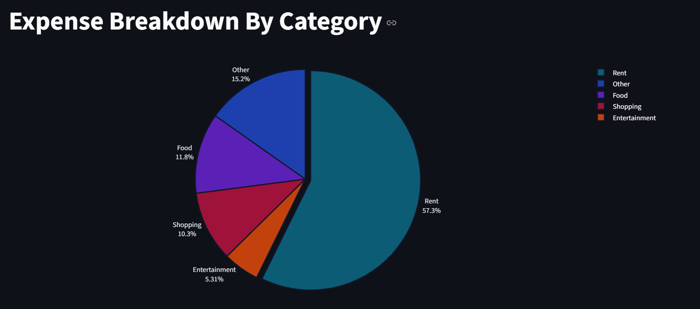
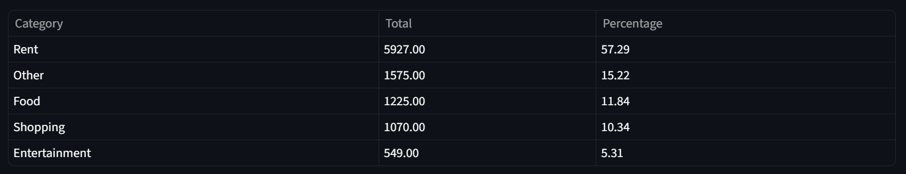
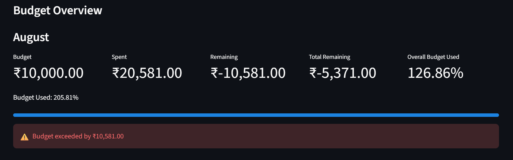
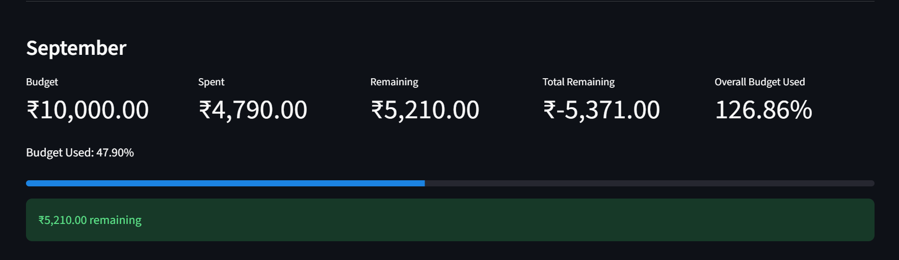
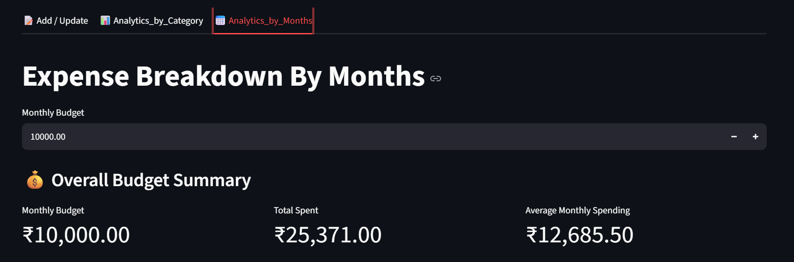

# 💰 Expense Tracking System

A full-stack expense tracking application built with **Python, Streamlit, FastAPI, and MySQL**. The application allows users to record daily expenses and analyze spending by category and month through an interactive web interface.

## ✨ Features

- Add and update expenses by date
- Record expense amount, category, and notes
- Supported expense categories:
  - Rent
  - Food
  - Shopping
  - Entertainment
  - Other
- Retrieve existing expenses for a selected date
- Analyze expenses within a selected date range
- View expense breakdown by category
- Interactive Plotly pie chart
- Category analytics table showing total and percentage spent
- View monthly spending
- Set a monthly budget
- View monthly budget, amount spent, remaining amount, and budget usage
- Progress indicator for monthly budget usage
- Budget exceeded/remaining status messages
- Overall budget summary
- Monthly spending bar chart
- FastAPI REST API between the Streamlit frontend and MySQL database
- Logging of database operations
- Automated backend tests using Pytest
- Windows `start_app.bat` script for starting the backend and frontend together

---

## 🛠️ Technologies Used

| Technology | Purpose |
|---|---|
| **Python** | Main programming language |
| **Streamlit 1.61.1** | Interactive web application frontend |
| **FastAPI 0.141.1** | REST API backend |
| **MySQL** | Database |
| **Pandas 3.0.5** | Data processing and analytics |
| **Plotly** | Interactive expense visualization |
| **Pydantic 2.13.4** | API data validation |
| **Requests 2.34.2** | Frontend-to-backend HTTP communication |
| **Uvicorn 0.52.1** | FastAPI server |
| **Pytest 9.1.1** | Automated testing |
| **MySQL Connector/Python 26.7.0** | MySQL database connection |

---

## 🏗️ System Architecture

```text
                    ┌─────────────────────┐
                    │    Streamlit UI     │
                    │      Frontend       │
                    └──────────┬──────────┘
                               │
                               │ HTTP Requests
                               ▼
                    ┌─────────────────────┐
                    │       FastAPI       │
                    │       Backend       │
                    └──────────┬──────────┘
                               │
                               │ SQL Queries
                               ▼
                    ┌─────────────────────┐
                    │        MySQL        │
                    │       Database      │
                    └─────────────────────┘
```

---

## 📂 Project Structure

```text
Expense Tracking System/
│
├── backend/
│   ├── db_helper.py
│   ├── logging_setup.py
│   ├── server.py
│   └── server.log
│
├── database/
│   └── expense_db_creation.sql
│
├── frontend/
│   ├── add_update_ui.py
│   ├── analytics_by_category.py
│   ├── analytics_by_months.py
│   └── app.py
│
├── screenshots/
│   ├── Add_or_Upadate_Tab.png
│   ├── Analystics_by_ Category_Tab.png
│   ├── Bar_Chart_and _Table.png
│   ├── Category_Table.png
│   ├── Expense Entry & Table.png
│   ├── Month_of_August.png
│   ├── Month_of_September.png
│   ├── Ovaerall_Summary.png
│   └── Pie_Chart_Category.png
│
├── tests/
│   ├── backend/
│   │   └── test_db_helper.py
│   └── conftest.py
│
├── requirements.txt
├── start_app.bat
└── README.md
```

> `__pycache__` and `.pytest_cache` folders are generated automatically by Python/Pytest and should not be committed to GitHub.

---

## 🗄️ Database

The application uses a MySQL database named:

```text
expense_manager
```

The database creation script is located at:

```text
database/expense_db_creation.sql
```

The `expenses` table contains:

| Column | Description |
|---|---|
| `id` | Unique expense ID |
| `expense_date` | Date of the expense |
| `amount` | Expense amount |
| `category` | Expense category |
| `notes` | Additional information |

The SQL file also contains sample expense records for testing and demonstration.

---

## 🔌 API Endpoints

### Get Expenses

```http
GET /expenses/{expense_date}
```

Retrieves expenses recorded for a specific date.

### Add / Update Expenses

```http
POST /expenses/{expense_date}
```

Deletes the existing expenses for the selected date and inserts the submitted expenses.

### Category Analytics

```http
POST /analytics/
```

Returns total spending and percentage breakdown by category for a selected date range.

### Monthly Analytics

```http
GET /analytics_by_month/
```

Returns total spending grouped by month.

---

## ⚙️ Installation & Setup

### 1. Clone the repository

```bash
https://github.com/sorofaf-hue/Expense-Tracking-System.git
```

### 2. Create a virtual environment

```bash
python -m venv .venv
```

Activate it on Windows:

```bash
.venv\Scripts\activate
```

### 3. Install dependencies

```bash
pip install -r requirements.txt
```

### 4. Set up MySQL

Run the SQL script:

```text
database/expense_db_creation.sql
```

This creates the `expense_manager` database and the `expenses` table.

### 5. Configure database credentials

Before publishing the project, make sure your real MySQL password is **not stored in `backend/db_helper.py`**.

Use environment variables or another local configuration method for credentials, and add the configuration file to `.gitignore`.

For example:

```text
DB_HOST=localhost
DB_USER=your_mysql_username
DB_PASSWORD=your_mysql_password
DB_NAME=expense_manager
```

> Never commit a real database password, API key, or other secret to a public GitHub repository.

---

## ▶️ Running the Application

### Option 1 — Start both services automatically on Windows

From the project root, run:

```bash
start_app.bat
```

The script starts:

- FastAPI backend using Uvicorn
- Streamlit frontend

### Option 2 — Start the services manually

**Terminal 1 — FastAPI backend**

```bash
cd backend
uvicorn server:app --reload
```

The API runs at:

```text
http://localhost:8000
```

**Terminal 2 — Streamlit frontend**

From the project root:

```bash
streamlit run frontend/app.py
```

Open the local Streamlit URL shown in the terminal.

---

## 📊 Application Screenshots

### Add / Update Expenses


### Expense Entry and Table


### Category Analytics


### Expense Category Pie Chart



### Category Analytics Table



### Monthly Budget — August



### Monthly Budget — September



### Overall Budget Summary



### Monthly Spending Bar Chart and Table


---

## 🧪 Testing

The project uses **Pytest** for backend testing.

Run the tests from the project root:

```bash
pytest
```

The current tests verify functionality including:

- Retrieving expenses for a valid date
- Handling a date with no expenses
- Handling an analytics date range with no matching records

---

## 🔄 Application Workflow

### Add / Update Expenses

```text
Select Date
     ↓
Retrieve Existing Expenses
     ↓
Enter / Update Amount, Category and Notes
     ↓
Submit
     ↓
Streamlit sends request to FastAPI
     ↓
FastAPI updates MySQL
     ↓
Success / Error message displayed
```

### Category Analytics

```text
Select Start Date and End Date
     ↓
Request analytics from FastAPI
     ↓
Calculate spending by category
     ↓
Calculate percentages
     ↓
Create Pandas DataFrame
     ↓
Display Plotly pie chart and table
```

### Monthly Budget Analytics

```text
Enter Monthly Budget
     ↓
Retrieve monthly spending
     ↓
Calculate remaining budget
     ↓
Calculate budget usage percentage
     ↓
Display monthly metrics and progress
     ↓
Display budget status
     ↓
Display monthly spending chart and table
```

---

## 🚀 Future Improvements

Potential future improvements include:

- Secure environment-based database configuration
- User authentication
- More expense categories
- Yearly spending analytics
- Expense search and filtering
- Expanded automated test coverage
- Data export functionality
- Online deployment
- Improved error handling and validation

---

## 👤 Author

**Fortune Sorofa**

---

## 📌 Note

This project was developed as an expense management application demonstrating a full-stack workflow with **Streamlit, FastAPI, MySQL, data analysis, visualization, and automated testing**.
